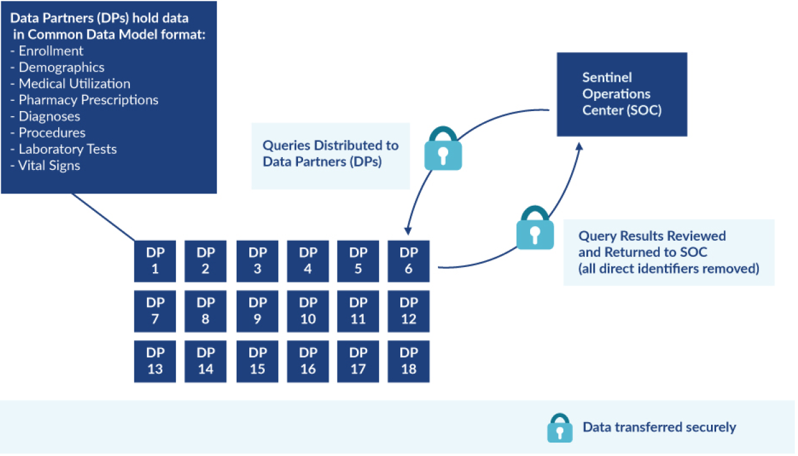
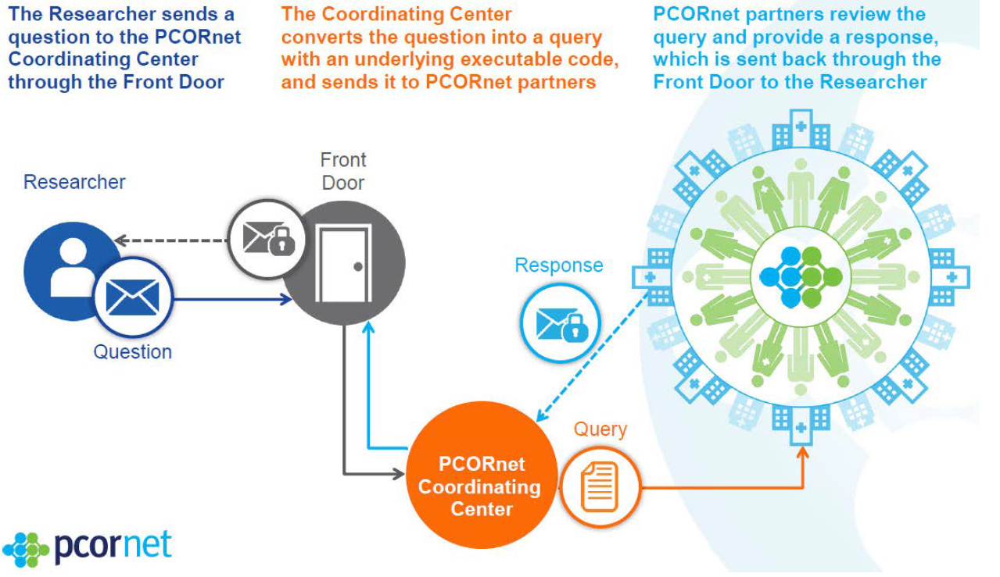
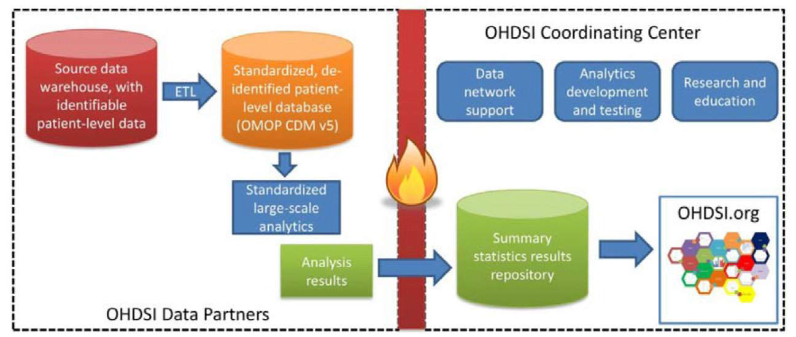
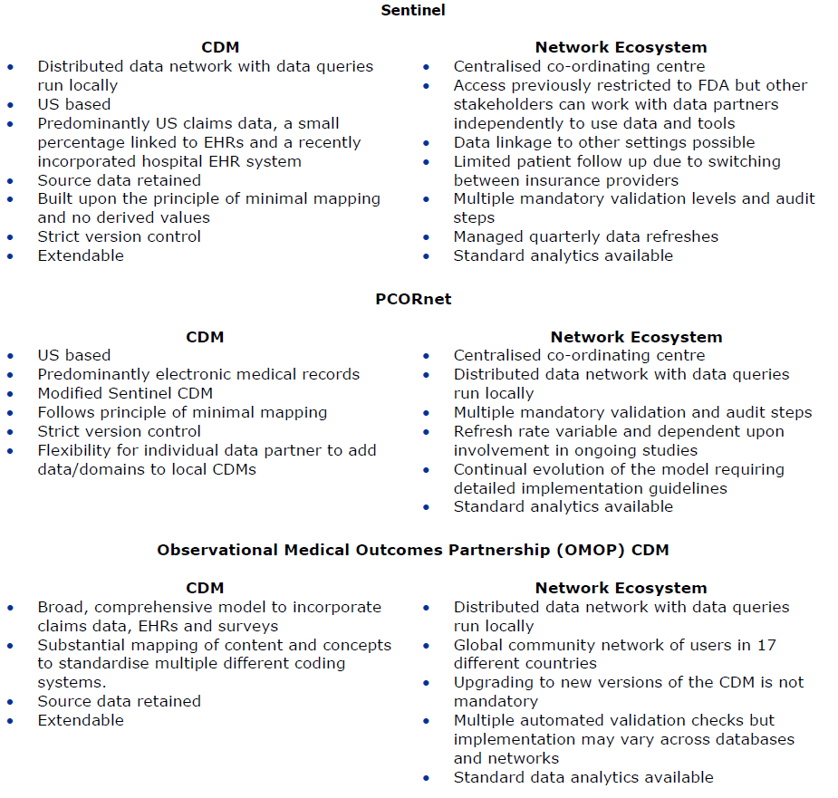
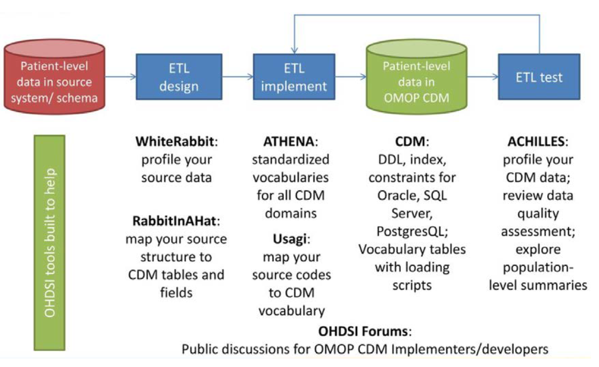

# Appendix

## A Common Data Model For Europe? - Why? Which? How?

*본 내용은 2017년 12월 11-12일 European Medicines Agency에서 주최한 회의에서의 workshop report "A Common Data Model for Europe? -Why? Which? How?" 의 본문을 요약 및 번역한 내용입니다.*

### Executive Summary

의약품의 개발 과정이 급속도로 빠르게 발전하고 있어 관련 규제 기관들에게 기존의 근거 기준들을 넘어서 product life cycle 전체에 대한 고려를 통한 의사결정의 필요성이 대두되고 있다. Regulator들은 약물에 대한 접근성과 장기적인 관점에서의 효율성과 안정성의 균형을 맞출 수 있도록 해야 하며, 신뢰가능한 수준을 결정하기 위한 근거들을 얻을 필요가 있다.

Real World Data (RWD)가 규제에 대한 많은 요건들을 충족시키는 근거로서 사용될 가능성이 있지만, 다양한 나라와 데이터베이스로부터 가져올 경우 그 유효성과 신뢰가능성이 떨어 질 수 있다. 경우에 따라 일반적으로 합의된 protocol을 이용해 연구를 표준화하는 방식을 사용하기도 하지만 이러한 방식을 사용하더라도 다양한 경로에 의해서 결과에 이질성이 발생함을 경험할 수 있다. 따라서 공통된 분석method로 다양한 데이터 set에 적용 가능한 Common Data Model으로 데이터를 표준화하는 것이 대안이 될 수 있다. 

이 회의에서는 유럽인들의 서로 다른 데이터들 또한 이러한 접근방식이 적용가능한지 알아보고, 규제에서의 요구를 충족시키는 데이터로 사용하기에 최적화된 설계적 특성은 무엇인지 알아보고자 한다. 회의에서 CDM은 여러 데이터베이스, 데이터 세트에 대한 통합된 분석을 가능하게 하기 위해 raw 데이터를 특정 연구와 관련 없는 공통 구조, 형식 및 용어로 표준화하는 메커니즘으로 정의되어 있다. 

이 회의에서는 United States Food and Drug Administration(FDA)에서 투자하고 개발된 Sentinel CDM과 Observational Health Data Sciences and Informatics (OHDSI)의 연구원들이 관여하는 Observational Medical Outcomes Partnership (OMOP) CDM에 대해 논의된다. 같은 분산형 CDM이지만 서로 다른 vocabulary 매핑의 범위로 인해 차이점이 존재한다.  Sentinel CDM의 경우 특정 연구의 질문에 대해 코딩 결정이 이루어져야 하므로 vocabulary 매핑에 한계가 있다. 반면 OMOP CDM을 활용하는 OHDSI의 경우 82개 이상의 데이터베이스를 가진 17개국의 데이터를 통합하고 데이터베이스내의 서로 다른 코딩시스템이나 언어로 매핑되어 있는 내용을 공통의 언어로 재구성하여 표준화할 수 있다. 이를 통해 개개의 의사결정이 가변적 이루어지는 것을 막을 수 있다. 두 시스템 모두 다양한 데이터 source를 이용한 연구를 가속화하기 위해 사용자정의 되고 재사용 가능한 분석 tool을 개발해왔다.

EU의 경우 환경이 다양하여 연구속도를 극대화하기 위해 OMOP의 표준화된 어휘가 필요하며 모델의 유연성과 데이터 source의 확장성 또한 중요하다. 또한 mapping이 이루어지지 않은 데이터나 source 데이터 또한 CDM에 유지되어야 하고, CDM으로 변환 시 손실 여부와 효과 추정을 평가하기 위한 방법 또한 필요하다.

유효성 검증 측면의 경우 FDA는 sentinel의 네트워크가 데이터 source에 대해 규제되어 있는 반복된 체계적인 변함없는 프로세스를 구현할 것을 요구하지만, OMOP CDM은 여러 네트워크 환경에서 서로 다른 정의된 사용자정책에 따라 이용된다.

National Patient-Centered Clinical Research Network (PCORnet)에서 볼수있듯이 역동적인 데이터를 그 사용자와 연결하는 것이 중요한 프로세스로써 끊임없는 데이터 관리가 필요하다. 따라서 가변성을 줄이기 위해 이용되는 데이터베이스당 하나의 검증된 CDM버전이 있어야 하며, 대중의 건강에 직접적인 영향을 미치는 규제 의사결정을 하기 위해 데이터 변환에 대한 명확하고 일관된 규칙을 수립하여 신뢰와 견고성을 확보해야한다.

동시에 이러한 시스템은 데이터 및 개인정보에 대한 보호를 엄수하여야 한다. 의료데이터라는 민감하고 개인적인 정보는 강력한 보안이 요구되고 미래에는 웨어러블, 스마트 디바이스로부터 수집된 복잡한 RWD의 사용 또한 고려하여 General Data Protection Regulation 이외의 새로운 요구사항을 고려해야 할 수 있다.

또한 시스템의 지속가능성을 위해 유럽의 데이터 플랫폼은 데이터 변환에 대한 초기 투자 이상으로 투자해야하며 역동적인 데이터 세트의 지속적인 업데이트 및 유효성 확인을 위해 지속적인 자금 지원 모델을 구축해야한다.

그럼에도 유럽에서 CDM을 구현할 시에 여러가지 문제점이 있을 것이고 limitation을 확인할 필요가 있다. 그러나 CDM은 현재 많은 문제점에 대한 해결방안이 될 수 있고, 이 보고서는 CDM을 뒷받침할 수 있는 지침사항이 제시되어있다. 여기서 논하고자 하는 바는 CDM이 적절하고 필요한가에 대한 문제이지 데이터의 quality나 변화가능한 vocabulary에 대한 우려, 혹은 분석툴에 의한 편향성의 생성에 대한 문제에 대해서 다루고자 하는 것이 아니다. 따라서 이를 CDM을 채택하지 않는 이유로 주장할 수 없다.

*규제 의사 결정을 위해서는 유럽 전역에 걸쳐 광범위한 인구를 대표하고 충분한 품질과 크기로 데이터를 충족하는 동시에 보호 요구 사항을 만족하며 투명한 방법을 통해 생성되어 여러 사용 case들을 뒷받침하면서 이익-위험 평가에 사용할 수 있는 시기적절한 데이터가 필요하다.*

### Background 

임상 진료를 통해 생겨나는 Real world data (RWD)인 의료데이터가 약물 개발이나 규제 결정에 근거로 제안되고 있다. 이런 데이터의 사용은 사후승인제의 근거로써 이전에도 사용되어왔고 2000년대의 Vioxx로 인해 안전성문제에 대한 중요성이 대두되면서 이러한 프로세스는 더욱 주목받게 되었다. 

그러나 이러한 데이터를 이용한 시기 적절하게 강력한 근거 마련에 사용되기 어려운 이유는 여러 데이터베이스를 통한 관측 연구가 유럽에서는 특히나 어렵고 시간이 오래 걸리기 때문이다. 이런 문제점은 common data model(CDM)을 통해 데이터를 변형하고 표준화하여 여러 데이터 set에 대한 표준화된 분석방식을 적용하여 효율성과 재현성을 높임으로써 해결할 수 있다. Asia-Pacific and European/US electronic health record (EHR)에서 OMOP CDM을 사용함에도 불구하고, CDM을 이용한 연구가 대부분 미국 청구자료를 기반으로 하고 있어 다양한 유럽인들의 데이터에도 이러한 방식을 적용할 시 데이터의 무결성이나 의미변경이 일어나지 않을 것이라 확신할 수 없다.

2017년 12월 11일,12일 개최된 워크샵에서는 질문의 유연성과 결과의 속도 사이의 균형을 맞추는 방법을 비롯해 CDM의 유효성을 검증하는 방법, 어디서 어떻게 데이터가 변형되어 손실되고 유연성을 잃어 버릴 수 있을지,어떻게 모든 이해 관계자의 전문지식을 포함하는 지속가능한 체계를 구축하여 유럽 전역의 네트워크를 운영할 수 있을지, 마지막으로 데이터의 충실도에 영향을 미치는 CDM의 핵심 설계 선택 방법을 정의하는 것에 대해 설명하였다.

### A Common Data Model – Why?

먼저 회의에서 논하는 CDM은 특정 연구에 대해 데이터의 일부만 변형되는 경우를 배제함을 기본으로 한다. 이제까지 RWD가 여러 의사 결정의 단계에서 사용되었지만, 현재 목표로 하는 바는 지속적으로 평가가 가능한 위험을 최소화할 수 있는 반복적인 규제 시스템을 구축하는 것이다. 이를 통해 의학적 해결방법이 없는 질병에 대한 조건부 승인을 위해 어느정도 불확실성을 제거하거나, 드문 질병에 대한 예후 인자와 종말점 확인뿐만 아니라 긴 잠복기를 가지고 있어 그 진행을 알 수 없는 질병에 대해서도 이해할 수 있도록 하고자 한다. 그러나 규제적 관점에서 볼 때 randomisation의 부족, 동시점의 control, 예측하지 못하는 편향성, 필요한 데이터 set이 있는지, 부작용 기록방식 어려움이나 데이터의 품질과 대표성을 확신할 수 없다는 문제점이 있다.

2016년 7월부터 2017년 6월까지 600건의 과학적 자문에서 3%만이 RWD를 사용하였으며 이 마저도 자명한 control의 데이터를 제공하는데 중점을 두고 있었다. 이러한 예로부터 RWD가 적절하게 활용되고 있지 못함을 확인할 수 있으며, 또한 유럽에서 미국의 데이터 소스를 이용해 생성된 evidence들을 이용하여 1차 데이터 수집을 했을 경우 부작용이나 유효성에 대한 확신이 어렵다는 문제점이 있다.

현재 규제당국이 직면한 문제 중 하나는 의약품에 확신하지 못한 부분이 있다면 치료방법이 많지 않은 질병을 가진 환자에게조차 의약품의 접근이 어렵다는 점이다. 이를 가능하게 하기위해 적절한 약물감시와 사후 근거 생성 방식의 고도화가 필요하다. 관련한 노력으로, 2015년에 EMA Patient Registry Initiative를 개설하여 등록된 환자들의 조기 의약품사용이 가능하게도 하고 규제 의사 결정에 어려움이 있는 의약품에 경우 신규 규제를 등록하기도 하여 이러한 문제를 해결하고자 하였다. 이러한 조기 약물 사용으로 RWD에 기반한 근거 수집을 빠르게 할 수 있도록 하여 제품이 출시될 수 있는 환경을 마련할 수 있다.

또한 의약품의 승인은 의약품을 이용하는 사람 수에 비해 매우 적은 수의 환자를 대상으로 연구가 이루어 질 수밖에 없고, (Dujinhoven의 연구에 따르면 2000년부터 2010년까지의 승인된 새로운 물질을 포함한 의약품에 대해 평균적으로 1,708명을 대상으로 연구되었고, 희귀 질병에 대한 약물의 경우 평균 438명만이 연구 대상 이였다.)  장기간 관찰이 어려울 수밖에 없다. (만성 사용을 위한 84개의 의약품 중 가이드라인을 만족하도록 6개월간 환자가 섭취한 경우가 68명(82.1%), 12개월간 환자가 섭취한 경우가 67명(79.8%)에 불과했다).

따라서 규제당국에서는 제품의 life cycle 전체에 걸친 이해도가 필요하므로 이를 위한 여러 조건을 만족하는 의미있는 데이터에 대한 규제가 필요하다. 그러나 EMA에 따르면 데이터의 구조, 언어, 용어 및 시스템이 다르기 때문에 이를 관리하는 부분이나 각각의 데이터 set에 대한 서로 다른 프로토콜을 정의하기 위한 시간이 필요하기 때문에 공통 프로토콜을 이용한 다중 데이터베이스 기반 연구에서 시간이 걸리는 현상이 발생한다.

이러한 모든 문제들이 CDM을 통해 해결된다고 볼 수는 없지만 공통된 구조, 형식 및 전문 용어로의 데이터 변환을 통해 표준화 분석을 어느정도 가능하게 할 수 있으며, 일관성을 확보하고 다중 데이터베이스 연구의 속도를 가속할 수 있다.

#### The FDA Sentinel System: meeting regulatory needs

FDA에서는 2008년에 규제 결정을 위해 사전에 승인된 무작위 통제 실험이나, 승인 후 보고시스템에 의해 안전성에 관한 데이터가 형성된다는 것을 기반으로 Sentinel을 출시하였다. 이후 승인 후 안전성 모니터링 시스템을 개선하기 위해 active risk identification and analysis (ARIA) system 또한 구축하였다. Sentinel 시스템은 생산품이 FDA의 규제사항을 만족하는지 사전에 확인할 수 있도록 하는 시스템으로 생산자와 FDA간의 안전성 모니터링에 대한 부담을 분담하였다. 이러한 Sentinel이 EU에서 사용하기에 적절한지 확인하기 위해서는 데이터가 적절한지, 적절한 방식을 통해 만족스러운 정밀도를 얻어 낼 수 있는지를 확인해야 한다.

Sentinel의 경우 CDM을 기반으로 하지만 데이터를 단순하게 구조화하는 것 이상의 개념을 포함한다. Sentinel의 데이터를 이용하기 위해서는 데이터의 품질을 높이기 위한 작업과 사용자 정의에 맞게 설계된 고도의 분석 툴이 필요하다. FDA의 규제 신뢰성을 얻기 위해 the Sentinel Data Quality Assurance system이 17개의 서로 다른 데이터 사용자에 맞춰 4단계로 나뉘어 데이터에 대해 1200개의 검증을 진행하게 된다. 따라서 쿼리 수에 관계없이 모든 데이터가 처리되고 이로 인해 시스템의 기본 cost가 발생한다. 이 때문에 Sentinel은 약물에 대해 적절한 분석 계획을 구현할 수 있는 시스템으로써 규제에 요구사항에 맞춰 정밀 분석이 가능하지만 소스가 다른 데이터를 CDM에 서로 다른 의미로 보관하기 때문에 여러 종류에 표준 분석에는 부적절하다.

또한 Sentinel은 FDA 보건 당국에 의해 운영되어 FDA에 보건 관련 활동을 승인받는 과정에 사용되며, 연구에 그 목적성이 존재하지 않는다. 따라서 데이터의 요청 시 FDA에서 처리가 완료된 데이터만을 얻을 수 있고 이 때문에 연구 설계 단계에서 Sentinel에 반복적인 여러 query를 보내야만 한다.

Sentinel이 해결하지 못하는 것이 여러가지 있지만 시스템 자체보다는 미국에서 건강보험이 분화되어 있기 때문에 발생하는 청구데이터 자체의 특성에 의한 약점이 많다. CDM이 필요한 이유가 엄격한 설계와 분석에만 있다면 데이터베이스의 크기만을 고려하면 되겠지만, 부적절한 설계 및 분석 방법의 확장으로 인해 정확한 결과를 얻을 수 없다는 사실을 인지해야 한다.

#### Validation of a Common Data Model Approach

관찰상의 evidence를 source data에서 사용가능한 evidence로 전환하는 과정에서 가변성이 발생할 여지가 많이 존재한다. 따라서 evidence 생성 경로 중 어느 곳이든 표준화를 적용함으로써 product에 대한 신뢰도를 높일 수 있다.

CDM은 표준화에 대한 방식을 데이터 구조(테이블 및 데이터 유형), 데이터 표현 방식, 어휘 (도메인을 체계화하는 용어), 코호트(임상적 현상의 표현 방식), 공변량 구성(변수에 대한 정의), 결과 기록방식 등 다양한 수준에서 정의할 수 있다. 이러한 모든 기준들이 프로토콜을 따라야 하지만 실제로는 엄격히 적용되기 어려워 연구 설계를 다르게 하면 동일한 데이터를 동일한 약물에 대한 분석에 사용시에도 결과가 서로 다르게 얻어 질 수 있다.

따라서 CDM내에서 어느 수준에서 표준화가 이루어져야 하는지 또한 이에 따라 연구 결과에 발생하는 영향을 이해해야 한다. 특히 유럽에서는 각각의 국가에 따른 서로 다른 가이드라인과 다른 문화에 의한 이질성이 발생하므로 동일한 연구문제에 대해 다른 연구자, 국가, 데이터베이스에서 적용하더라도 유사한 결과를 얻어 낼 수 있는지가 관건이다. 유효성이라는 것은 상관관계의 존재와 부재를 식별할 수 있음을 의미하므로 이는 코딩 시스템과 같은 데이터베이스의 특성에 영향을 받기 쉽다.

또한 CDM을 통한 공통적인 분석 방식이 신뢰성과 타당성을 증가시킬 수 있는지 고려해야 한다. CDM은 source data를 다른 vocabulary로 매핑시 복잡해지거나 가변성이 발생할 수 있다는 주장이 제기될 수 있으나, CDM은 데이터와 사용자의 연관성을 없도록 하면서 일관성 있는 변형 방식과 분석 방법을 통하여 타당성을 얻을 수 있다. 변형된 데이터는 서로 다른 연구에 대해 재사용 될 수 있다는 장점이 있다. 그러나 데이터의 변환만을 유효성의 근거로 삼아서는 안되며 ETL프로세스(데이터 변환을 구현하는 소프트웨어)같은 소프트웨어의 유효성, 통계적 의학적 method 또한 검증하여야 한다. 

공통된 프로토콜을 통한 접근법의 경우 분석자 입장에서 복잡하지만, 데이터관리 부분에 있어서는 간편하다. 반대로 CDM을 이용한 경우에는 공통된 어휘에 대한 매핑이 적절하게 이루어지게 하여 데이터 관리를 하는 부분에서 복잡하다. 어느 것도 정답이라고 할 순 없지만 CDM은 연구의 속도를 빠르게 하면서 그 quality를 반드시 떨어뜨리지는 않는다는 점과 분석자 입장에서 복잡성이 증가할 경우 시간이 오래 걸릴 수 있다는 것을 고려해야 한다.

### A Common Data Model Which?

해당 논의는 CDM 모델의 의미론적, 실용적인 특성을 중심으로 이루어지므로 각각의 이해관계자가 요구하는 바와 역할에 대해 정의해야 한다. 결과적으로 우리에게 필요한 것은 신뢰성과 타당성을 제공하면서도 유럽 전역에서 전례없는 규모로 투명하고 신속한 연구를 할 수 있도록 하는 모델이다.

#### The Sentinel System

Sentinel CDM은 6,690만명의 구성원과 144억개의 약품 관계자 및 133억 개의 의료 관계자에 대해 네트워크를 제공하는 분산형 데이터베이스이다. 네트워크는 데이터를 세분화하여 저장하기 때문에 청구 데이터, EHR 및 레지스트리를 비롯한 어떠한 데이터 소스형태로든 확장 가능하다.

모든 Sentinel 파트너는 CDM을 관리하는 Harvard Pilgrim Healthcare Institute와 계약을 체결하여 FDA와 직접 교류하지 않고 이를 통해 상호 작용한다. 또한 sentinel의 CDM이 FDA의 요구사항에 대해 중점적으로 설계되었으며, FDA에서 모든 자금을 제공하므로 Sentinel 시스템을 완전히 통제 가능하다. FDA의 동의 없이는 내용 변경 또한 불가능하다.

Sentinel CDM은 또한 불필요한 매핑을 진행하지 않고 데이터를 통해 미리 파생변수나 테이블을 형성하기 보단 사용자가 실행시에 생성하도록 설계되었다. 이 CDM은 현재 고유한 한 사람에 대해 12개의 데이터 테이블을 포함하고 있다. 그리고 데이터 세트가 별도로 유지되어 제각각 수정되기 때문에 어떤 경우에는 문제가 발생할 수도 있다.

모델의 구조가 이해하기 쉽게 되어있고 대부분의 데이터가 매핑되어 있지 않기 때문에 내부에 새로운 값을 추가하는 것이 간단하다. 

Sentinel은 먼저 데이터 partner에게 데이터가 요청되면 쿼리가 로컬에서 실행되고 고유한 식별정보가 제거된 분석 데이터를 중앙서버로 보내면 하버드 필그림에서 분석되는 것이다. 

Sentinel tool box는 CIDA (Cohort Identification and Descriptive Analysis)를 비롯한 여러 분석 도구 모음을 기반으로하여 FDA에서 수행된 분석을 고도로 사용자 맞춤화 할 수 있지만, 데이터는 가장 세분화된 상태로 사용된다. 이러한 접근법은 약물 섭취시에 따른 결과를 용량, 경로 및 제형의 수준에서 각각 정의할 수 있는 것과 같이 매핑 최소화를 통한 question의 유연성을 늘리고자 한 결과이다. 따라서 표준화와 모델의 정교함을 가지고 있어 앞에서의 모델로서의 요구를 만족하지만 FDA 필요에 의해서만 그 변경이 가능하다는 점을 고려해야한다.

#### The National Patient - Centered Clinical Research Network (PCORnet)

Sentinel의 경우에는 청구 데이터를 기반으로 하고 있는데, PCORnet의 경우 EHR을 sentinel CDM에 적용시키고자 한 것이다. PCORnet은 환자에게 가장 적합한 결과를 얻고자 하는 환자 중심의 임상 연구 네트워크로써 모든 주의 서로 다른 79개의 건강관리시스템을 포괄한다. 고품질의 대규모 임상 관측 및 중개 연구가 가능하도록 하는 것이 궁극적인 목표이다.

PCORnet은 sentinel을 기반으로 하여 개정되며 발전하였고, 일관되게 유지된 점은 CDM이 source 데이터에서 얻어진 값 그대로 반영함으로써 광범위한 매핑에 대한 부담을 줄이고 이 과정에서 발생할 수 있는 손실을 최소화했다는 점이다. 네트워크를 구축하는 과정에서 CDM에 지속적인 변경사항이 추가되며 현재 버전 4.0에 있다. 그러나 잦은 변경에 의해 ETL프로세스 및 분석 도구를 업데이트 해야 하는 어려움이 있다.  또한 CDM의 모든 데이터 관계자가 로컬에 전체 CDM을 가지고 있을 필요 없이 네트워크에서 자유롭게 local CDM이 수정될 수 있어야 함이 인지되었다. 

순환적 데이터 집적 사이클이 PCORnet 데이터 전략의 핵심이다. 연구자가 특정 연구 관련한 데이터를 주기적으로 업데이트하면 PCORnet co-ordinating centre에서 쿼리로 전환하여 PCORnet 관계자에게 전달하여 관계자가 CDM에서의 편차가 허용 가능한 정도인지를 고려하여 업데이트를 승인한다.

미국에서는 EHR용 소프트웨어를 제공하는 업체가 단 2곳이지만 사용자 환경에 따라 변경이 이루어져 각각의 진료소마다 다른 방식으로 사용된다. 이 때문에 모든 partner가 구축하는 공통적인 데이터 요소가 아닐 경우 table에 대한 최소한의 지침이 필요로 된다. 또한 데이터 관계자는 데이터 요소에서 ETL이 각각 어떤 방식으로 구현되었는지 기술해야 한다. 따라서 변경에 따라 지속적인 데이터 관리가 요구된다.

#### Observational Medical Outcomes Partnership (OMOP) CDM

미국에서 가장 주요하게 사용되는 CDM은 OMOP (Observational Medical Outcomes Partnership) CDM이다. OMOP CDM을 뒷받침하는 네트워크는 OHDSI(Observational Health Data Sciences and Informatics)이며 현재 82개이상의 데이터베이스에 약 12억건의 건강기록을 보유한 17개국의 200여명의 연구자가 참여하고 있다. 최근 유럽에서는 OMOP CDM을 도입하기 위한 관심이 증가되고 많은 유럽인의 데이터를 OMOP CDM으로 변형시키기 위한 자금확보를 위해 Innovative Medicines Initiative (IMI) project 또한 진행중이다. OMOP CDM은 Sentinel, PCORnet과 같이 다른 구조의 서로 다른 source로부터의 데이터를 통일된 테이블 형태로 표준화하지만 가장 큰 차이점은 여러 다른 코딩 시스템이나 원본의 데이터베이스에서 사용된 보편적인 어휘를 공통의 어휘로 매핑하여 표준화한다는 것이다. (예 : ICD9/10 에서 SNOMED-CT으로.) 이를 통해 관찰 연구의 속도를 증진시키고 각각의 용어에 상세 설명이나 속해 있는 Domain을 할당할 수 있다. 표준화된 소스코드를 저장하는 동시에 원본의 데이터 또한 저장하기 때문에 이 또한 사용이 가능하다. OMOP CDM또한 그림(figure 3.)에서 보듯이 CDM의 일반적인 형식을 갖추고 있다.

OMOP은 행정 청구 기록과 EHR 데이터를 모두 개인적이든 공적이든 활용 가능하며, Sentinel과 달리 파생 변수를 추가할 수 있다. 이 모델은 OHDSI의 연구자의 요구에 의해 확장이 가능하다.

OMOP의 어휘는 National Library of Medicines Unified Medical Language System (UMLS)에서 구축된 표준을 따르며 쿼리의 표준화를 위해 5,720,848개의 개념과 32,612,650개의 개념간 관계를 포함하는 32개 영역에 대한 78가지의 vocabulary가 존재한다. ATLAS라고 하는 어휘 검색을 가능하게 하는 tool 또한 개발되어 있는데 ATLAS는 환경, 약물 종류, 절차, 측정, 관찰방식과 같은 여러 요소에 대한 코호트를 구축할 수 있게 도와주고 표준화된 어휘나 개념에 대해 query를 개발을 가능하게 한다. 구축된 코호트 내에서 임상적 특성 (요약된 설명과 발병률의 추정), population level 영향 평가와 같은 기능을 제공할 수 있으며 필요하다면 원본 데이터에 대한 분석 역시 가능하다.

하나의 vocabulary로 매핑하는 과정을 통해 유럽 전역의 서로 다른 약물 코드를 RxNorm에 맞추어 세분화하여 코딩하는 것 역시 가능하지만, 이러한 과정은 미국 시장을 기반으로 되어 있기 때문에 유럽 의약품에도 확장적용이 가능하도록 해야 한다. ATC (Anatomical Therapeutic Chemical)를 이용해 로컬 코드를 매핑하는데 사용하기도 하였지만 이 과정에서 분류 체계에 대한 형식과 정보를 잃게 되므로 적절하지 않다.

#### Challenges of Implementing a CDM in Europe

유럽은 국가적인 보건 의료 시스템을 갖추고 있고 풍부한 데이터를 제공하지만, 여러 코딩시스템, 언어, 구조, 내용 및 조건으로 인해 유럽 데이터를 이용해 CDM을 적용하는 것이 복잡하다. 현재까지 다중 데이터베이스 연구를 진행하기 위해 여러 방식이 채택되었지만 유지 가능하고 시기적절하게 근거를 제공하여 규제 마련에 도움이 되도록 하는 플랫폼은 존재하지 않는다.

CDM을 적용하는지에 대한 여부와는 상관없이 다중 데이터베이스 연구를 진행할 때 약물동력학의 핵심 원칙은 지켜야 한다. CDM의 사용시 편향성이 발생할 수 있는데 이는 원본 데이터 그 자체에서 발생하거나 연구 분석 방식에서 기인할 수 있다. OMOP의 경우에도 매핑 과정이나 잘못된 분류를 통해 편향성이 발생할 여지가 존재한다. 또한 앞에서 언급한 것처럼 RxNorm이라는 약물에 대한 표준 어휘가 미국에 기반을 두고 있고 이를 유럽 환경에 맞춰 확장성이 필요함 또한 인지 해야한다.
그럼에도 특정 연구나 데이터베이스에 적용가능한 유연성을 가진 모델로써 앞서 말한 CDM을 적용할 가능성이 있으며, OMOP CDM에서의 원본 데이터의 보관을 통한 활용 또한 추가적으로 필요하다.

매핑이 광범위하게 이루어져 생길 수 있는 잘못된 분류에 의한 오류는 비단 CDM에만 적용되는 것이 아니라, 다중 데이터베이스 연구나 개별 참여자의 메타분석을 수행할 때 발생하는 요인이다. 따라서 CDM의 매핑시에 유사한 구조로 공통화 시킨다고 하여 고유한 특성을 잃어버리게 된다고 속단하지 않는 것이 중요하다. CDM을 통해 수행된 연구에 대한 신뢰를 구축하기 위해서는 EU의 데이터가 CDM으로 변환되는 과정에서 정보의 유실이 일어났는지 신중히 확인할 것이 필요하다. 이를 확신할 수 없다면 유럽의 데이터를 처리하는 접근방식에 최적화되어 있는 것이 OMOP인지 Sentinel인지 알 수 없다.

#### Lessons learnt from concrete case examples 

최근 몇 년 동안 유럽에서의 EHR을 OMOP CDM으로 전환시키는 과정에서 얻은 교훈이 몇 가지 있다.

ETL프로세스의 첫번째 단계는 모든 소스데이터를 OMOP내에 mapping되지 않은 원본데이터로 보관하는 것인데, 영국의 THIN 데이터 베이스로부터 OMOP CDM으로의 매핑 이전 시 출생 전과 사망 후에 관련된 정보를 처방전에서 손실하였다. 유사하게 RxNorm이 모든 의약품을 cover하지 못하여 많은 문제가 발생하였다. 관련 연구자들은 손실된 데이터의 양을 알 수 있도록 프로세스의 효율성을 조사하기도 하였다. 이를 통해 구조적으로 매핑 프로세스가 성공적으로 진행될지 확인하는 것이 중요하며 데이터 손실 시 그 근본적인 원인을 파악할 수 있어야 한다는 것을 알 수 있다.

두번째 단계는 어휘 매핑인데 Dutch IPCI database를 OMOP CDM의 용어로 매핑하는 과정에서 50%의 손실이 발생하지만 처방전에 포함되는 95%의 용어를 얻을 수 있었고, 특별 품목을 제외하고는 대부분이 포함 되어있었다. 따라서 이런 종류의 mapping에서의 손실은 크게 영향을 미치지 못할 것이고 어휘의 확장성을 통해 해결될 수 있다.

여러 관계자가 CDM에 접촉할 수 있도록 하는 것에 대한 관점을 sentinel과 함께 진행한 Innovation in Medical Evidence Development and Surveillance (IMEDS) programme에서 알 수 있다. 비 FDA 관계자가 sentinel에 접근할 수 있는 프로세스를 개발하여 두가지 쿼리에 대해 테스트해보았고 이로부터 여러 관계자의 협력을 통해 정책 및 절차를 개발할 수 있음을 확인했지만 네트워크 액세스시에 절차를 명확히 해야함이 중요한 문제로 떠올랐다. 

지금까지의 대부분의 연구결과는 데이터베이스를 CDM으로 전환하는 경우에 버전관리와 관련한 이슈들을 많이 생성했다. 이러한 문제는 약물 역학 연구에서 신뢰도를 감소시키고 서로 다른 결과 도출로 인한 복잡성을 늘린다. 

CDM의 유효성 검증을 위해 같은 조건과 비슷한 목적성의 tool을 이용해 OMOP과 sentinel 각각에서 6가지 약물에 대한 두가지 방식의 분석방법을 사용하여 비교해 보았을 때, 두 CDM 모두 데이터베이스를 CDM으로 전환하는 과정에서의 정보 손실은 거의 일어나지 않았지만, 특정 환경에서의 코호트 관계성과 그 위험성에 대한 점수에서 차이가 발생하였다. 이를 통해 CDM으로 변환을 통한 연구가 많은 제한 사항이 있고 특정 CDM에 대한 전문 지식없이 맹목적으로 실행할 경우 신뢰도가 낮은 결과물을 얻을 수밖에 없다는 것을 알 수 있다.

이후에 진행된 IMI가 투자한 EMIF 프로젝트에 10개의 데이터베이스 매핑 연구를 포함하여 얻어낸 교훈을 정리해보자면 다음과 같다.

* OMOP CDM 및 분석 도구에 대한 전문성을 바탕으로 local 코딩 시스템에 대한 전문 지식을 갖춘 데이터 변환을 위한 전문 팀의 중요성
* 프로젝트 관리의 중요성
* 어휘 매핑에 대한 충분한 투자 
* CDM의 버전 관리 필요성
* 시간 경과에 따른 도구 및 버전 관리와 CDM 환경의 공명성
* OMOP CDM 및 OHDSI 도구의 관계자 교육의 필요성

### Validation of a CDM – what is needed for regulatory decision making?

*‘loss of fidelity begins with the movement of data from the doctor’s brain to the medical record’*

*Clem McDonald, MD Director, Lister Hill Center for Biomedical Informatics National Library of Medicine, USA*

규제 관점에서의 관심사는 데이터의 유효성을 확인하는 것과 CDM으로 변환 시 얻을 수 있는 이점에 관한 것이다.

#### Validation through the Sentinel network

CDM의 유효성을 검증하는 방법은 sentinel과 같은 네트워크 데이터를 이용한 연구와 공통 프로토콜을 이용한 연구에서 차이점이 있다. 공통 프로토콜을 이용하는 경우 데이터의 정확성에 중점을 두고 값이 적절하게 입력되었는지 확인해야 하지만 CDM의 경우 모든 data에는 문제가 없이 준비됨을 전제로 해야 한다. 전자의 경우 데이터 유효성 검증에 대한 책임이 연구자에게 달려 있고 후자의 경우 네트워크를 관리하는 자의 몫이다. 네트워크에서 데이터의 유효성 검증이 일어날 경우 시간이 지나더라도 반복해서 진행되고 일관성이 있어야한다. 이를 통해 모든 CDM을 이용하는 과정에서 매번 Data의 유효성 검증할 필요가 없도록 해준다.

sentinel은 1200개의 유효성검사를 만족해야 한다. 이러한 quality assurance를 거쳐 데이터의 추세를 파악하고 무결성을 검토한다. 테이블의 모든 변수에 대한 내용이 완성되었는지, 변수 간 테이블 간의 무결성이 유지되는지의 두 가지 수준에 대한 ETL 확인을 한다. 데이터가 고쳐질 때마다 새 데이터를 추가하는 것이 아니라 구조와 내용 모두를 변경시키기 위해 전체적으로 다시 쓰인다. 

Sentinel 시스템의 핵심은 모든 이슈들에 대해 기록하고 추적하여 후에 해결방법을 참조하기위한 지식관리 구조를 구축하는 것이다. 이 시스템은 모든 코드를 기록하고 그 사용을 조사하여 불완전한 데이터가 존재했었는지를 확인한다. 이렇게 각각의 쿼리에 대한 데이터의 일련성 확인도 가능하지만 서로 다른 유사한 쿼리를 통해 비슷한 결과가 나오는 지 확인하여 데이터의 무결성이 유지되는지도 확인가능 하다. sentinel 네트워크가 데이터 관계자의 투자에 의해 quality assurance가 가능한 반면 데이터 보유자에게 그 책임이 있는 경우에는 자발적인 지불이 이루어져야 한다.

#### Validation through the OHDSI network

OHDSI의 경우에 데이터 검증은 데이터 자체가 아닌 전체적인 생성 경로에서 이뤄지며 데이터유효성 검사, 소프트웨어 유효성 확인, 진료적인 부분의 유효성 확인 그리고 방법의 유효성확인까지  총 4가지 방법으로 진행된다. OHDSI는 개방형 네트워크로써 고안된 툴을 이용해 누구나 유효성 검증을 할 수 있지만, OHDSI의 사용자 전체에게 이 같은 프로세스가 강제로 적용되는 것은 아니라는 점에서 sentinel과 비교된다. 유효성 검사 프로세스는 다음과 같은 질문에 대한 답변을 제공한다.

* CDM에 소스데이터가 보존되어 있다는 것을 보장 할 수 있는가?
* ETL 협약을 어떻게 준수할 것인가?
* 어휘의 맵핑이 잘 이루어졌는지 어떻게 확인할 수 있는가?
* 기본 데이터와의 불일치를 어떻게 찾아 낼 수 있는가?

OMOP CDM의 데이터 세트는 구조의 제약 조건이 있어 올바르지 않게 입력 될시에 ETL프로세스에서 자동으로 거부된다. 또한 OHDSI는 ETL프로세스에서 사용 가능한 tool을 제공한다.

White rabbit: 소스데이터의 구조를 파악하고 값의 패턴을 확인한다. 어떤 형식이든 사용 가능하다.

Rabbit in a hat: ETL의 프로세스를 일관된 형태의 문서로 공유할 수 있도록 메커니즘을 제공.

USAGI: 완전히 매핑되지 않은 어휘의 비율을 나타낸다.

ACHILLES: 변환된 데이터베이스을 모든 도메인에 대하여 데이터의 특성과 품질을 검사하는 패키지

ACHILLES HEEL: 표준화된 데이터의 불일치나 삭제, 관찰 기간에서의 이탈 등에 대하여 요약하여 주고 누락된 데이터의 확인 같은 작업을 한다. 또한 Sentinel 3단계의 준하는 체크를 하며, 적합성 검사를 통해 식별된 이상치를 시각화하여 보여준다. 

유럽에서는 여러 코딩시스템이 사용되고 있기 때문에 어휘 맵핑의 유효성 검증은 주요한 사안이다. 지금까지의 대부분의 OMOP 어휘가 OHDSI의 외부에서 형성되었지만 수정없이 사용되고 있고, 직접 만든 매핑이 존재하면 다른 코딩 관리자가 검토하게 되고 이에 대한 리뷰를 또한 존재한다.

서로 다른 코딩으로 된 두 데이터베이스에 표준화방식을 적용하여 위험성에 대해 분석했을 때 27개의 약물의 결과가 전체적으로 동일하게 나오기도 하였다.
임상적 유효성 검증은 분석의 방법이 clinical한 질문에 대한 답을 얻기 위한 의도에 얼마나 일치하는지를 의미한다. 마지막으로 논의된 유효성 검증 영역은 진단검사의 방식이나 통계적 방법이 얼마나 유효한지를 체계적으로 검증하는 것이다.

OHDSI에서는 유효성 검증이 연구 환경을 개선하고자 하는 구성원의 자발적 참여에 의해 이루어 지도록 개방하여 투명성을 가지며 모든 면에서 진보되도록 하였다. 

#### The CNODES network – Lessons learnt from a Sentinel CDM pilot

CNODES 네트워크는 7개의 캐나다지역을 포함하며 영국의 CPRD(Clinical Patient Research Datalink)를 활용하여 1억명이 넘는 사람들에 대한 데이터를 제공하는 중앙 행정 보건 네트워크이다. 그러나 이는 매우 복잡하여 이용하기 위해서는 개별 프로토콜이 필요하며 통계 분석 계획 또한 요구되었다.

Sentinel을 이용한 파일럿이 2017년 4월에 착수되었고 당시에 테이블 전환이 거의 끝난 상태였다. 캐나다 데이터에 없는 영역을 채워 넣기만 하면 되는 상태였고 캐나다의 데이터와 sentinel의 데이터가 유사하다는 점에서 제안되었다. CNODES는 CDM과 CNODES 표준화 도구 모두를 이용하는 것에 대한 유효성 검증을 캐나다 보건 정보원 (Canadian Institute for Health Information)의 독립적 검증을 통해 연구할 계획이다.

CNODES는 CDM을 통하여 캐나다인의 건강에 대한 답을 간단한 쿼리를 이용하여 신속하게 얻어 낼 수 있을 것이라 믿는다. 더군다나 FDA의 CDM을 이용하므로써 캐나다의 데이터와 미국 데이터에 대한 교차 관할 공동 작업 또한 가능하게 할 것이다. 하지만 CDM의 도입이 CNODES 표준화 도구에 대한 필요성을 없애고 복잡한 역학 연구를 가능하게 하는 것은 아니다.

#### Acceptability of RWD for Regulatory decision making

규제 결정에 요구되는 증거로써 임상 시험의 결과를 이용하고 있기는 하지만 관찰 연구를 활용하는 경우는 거의 없다. 어떤 종류의 질문에 답하기 위해서는 관찰 연구가 더 적절할 수도 있다. 

그러나 완벽한 조건에서의 임상시험은 여러 장점이 있다. 첫번째로 관찰 연구에서 발생하는 통제되지 않은 조건에 의한 가변성을 고려하지 않아도 된다. 또한 편향되지 않은 결과를 얻기 위해 고도로 선택된 집단을 선택할 수 있다는 장점 또한 있다. 세번째로 대부분의 RCT 연구는 플라시보 효과를 고려하는 동시에 무작위 선별에 의한 편향성을 배제할 수 있다는 장점이 있으며, 네번째로 RCT에서의 데이터검증이 표준화 되어있는 기준에 의해 최적화되어 주요한 오류를 즉시 확인 가능하다는 장점이 있고 마지막으로 성공 기준과 분석에 대해 이미 명시되어 있기 때문에 다중성을 가지는 경우를 배제할 수 있다는 장점이 있다. 반면 관찰 연구에 경우 Data 세트에 대한 정보를 갖지 못한 채 프로토콜을 정해야 하므로 연구 결과가 프로토콜에서 예측하지 못한 범위에서 측정될 수 있는 가능성이 있다. 이러한 이유들 때문에 관찰 연구는 큰 집단에서 시행되더라도 그 신뢰도 값이 작을 수 있다.

규제적인 관점에서 신중하게 설계된 CDM을 통하여 관찰 연구에 대한 잠재적인 편향성을 제거하고 이를 일반화과정에 사용할 수 있도록 도움을 줄 수 있다. 이를 위한 분산 데이터 시스템을 구축하기 위해서는 많은 비용이 요구되고, 특히 데이터 변환에 드는 비용은 중요하다. 분산형 데이터 네트워크는 최소한의 데이터 이동을 포함하도록 설계되었고 통일된 구조로 입출력이 이루어 지므로 데이터를 신속하게 확인 할 수 있고, 윤리적 문제 또한 해결 할 수 있다.  

### A CDM in Europe: potential solution

유럽에서의 CDM 시행 시 제기된 문제점에 대한 4가지 세션이 있었다.

* 유럽에서의 CDM 적용에 대한 구체적인 문제점은 무엇인가?
* 유럽에서의 CDM 운영방식은 무엇인가?
* 유럽의 CDM 검증에 어떤 원칙을 적용해야 하는가?
* 규제 문제에 대한 해결책이 될 수 있는 CDM의 핵심적인 설계 방식은 무엇인가?

이 부분은 그 세션에 대한 요약이다.

첫번째 문제에 대해서는 먼저 CDM을 지속적으로 유지하기 위한 자금 투자가 뒷받침되어야 한다는 점이다. 지금까지의 투자가 대부분 단기 투자였기 때문에 충분한 결과를 얻을 수 없었기 때문에 Sentinel이 FDA에 의해 입법적인 요구사항이였기 때문에 발전할 수 있었다는 점에 착안하여 EMA를 비롯한 EU data의 수혜자가 될 기구에서의 입법적인 요구가 있어야 한다고 주장된다. 또한 국가적인 이질성을 고려한 네트워크의 거버넌스에 대한 논의 역시 중요하게 다뤄졌다. 데이터 보호법을 완전히 준수하면서 ENCePP와 ADVANCE에 서 합의한 바에 기반하여 데이터에 대한 전문성을 활용하기 용이하고 신뢰도 있는 네트워크 구축을 필요로한다.

기술적인 측면에서는 CDM으로의 데이터 변환 시 일관된 규칙을 적용하여 신뢰성을 확보해야 한다는 점이 있다. 또한 모든 언어를 매핑하지는 못하므로 모든 소스 데이터 또한 CDM에 유지되어야 한다. 

회의에서 언급된 성공적인 CDM의 공통점으로는 반복적인 방식을 통해 시간이 지나면서 제시된 문제가 해결되고 이로부터 확장성을 가져야 한다는 점이였다. 사용자 case의 측면에서는 약물의 안전 및 사용과 같은 핵심적인 경우부터 시작해서 약물의 효과성 입증과 같은 방법론적인 연구에도 적용될 수 있어야 한다.

두번째로 유럽에서 CDM이 운영되는 방식에 관한 논의에서도 자금 지원 문제가 다시 한번 강조된다. 이를 위해 결정권자가 기본 인프라 확립 및 시스템 유지 관리, 자금 조달 방법에 관하여 고민하여야 한다. 또한 인프라내에 산업계가 기여하도록 하는 것 역시 생각 해볼 만하다.

또 한가지 성공적인 네트워크의 요소는 데이터 소지자의 적극적인 참여가 수반되어야 한다는 것이다. 데이터베이스 소지자는 CDM의 참여가 데이터에 대한 권리 상실로 여겨서는 안되며 받아들여야 한다. Sentinel의 예에서 알 수 있듯이 data 관계자의 역할이 중요하다. 단순히 data를 제공하는 것뿐만 아니라 시스템이 정확한 역할을 할 수 있도록 신뢰를 확보할 수 있어야 한다.

조직화된 sentinel이나 열린 공동체인 OHDSI에 의해 형성된 OMOP중에서 어떤 거버넌스 구조에 유럽의 CDM이 속해야 할 지, 서로 다른 이해관계자들의 요구에서 어디에 우선순위를 둘지를 고려해야 할 것이다.

세번째 질문인 CDM의 유효성 검증을 위해 적용될 원칙은 무엇인가에 대한 논의에서는 소프트웨어에 대한 유효성 평가가 아닌 데이터의 유효성 검증에 대해 중점을 두고 있다. 유효성 평가에 대한 첫번째 단계의 프로세스로서 sentinel에 적용되는 적합성 검사만을 반영하자는 제안이 있다. 적용되는 검증 메커니즘에는 개방성, 투명성 및 경쟁 가능성이 모든 CDM에 있어서 중요한 부분이 될 것이다. 유럽 네트워크를 관장하는 유럽센터가 없다면 유효성 검사를 어떻게 실시할 것인지, 데이터 소유자에게 이를 주기적으로 진행할 수 있도록 할 수 있을지, OHDSI의 공동체적 관점이 규제적인 관점에서도 적용될 수 있을지가 관건이다.

마지막으로 규제 문제에 대한 해결책이 될 수 있는 CDM의 핵심적인 설계 방식은 무엇인지에 대한 논의가 이루어졌다. CDM의 사용범위는 사용자와 데이터세트에 영향을 받지만 항상 확장이 가능해야 한다는 것이 중요하다. Sentinel과 OMOP의 비교에서 알 수 있듯이 속도와 목적성의 관점에서 균형을 맞추어야 할 수도 있다. 

결국 다른 종류의 CDM이 규제당국에 의해 선택되더라도 드물게 발생하는 질병이나 반응에 대해서 글로벌한 데이터베이스조사가 이루어질 수 있도록 운용이 가능해야만 한다. 

### Discussion

약물개발의 급격한 변화를 규제환경이 그 속도를 따라잡을 필요가 있다. 예를 들면 어떠한 의학적 치료방법을 가지지 못한 약물에 대해 1상에서의 데이터만 존재하고 2상에서의 데이터를 찾을 수 없어 안전 및 유효성에 대한 평가를 통과하지 못하고 장기간의 데이터 수집이 필요한 경우가 발생할 수 있다. 규제 툴박스는 PRIME(치료방법이 없는 질병에 대한 약물의 개발을 지원하기 위해 개설된 scheme을 의미)이나 규제완화 등을 통하여 노력하고있지만 여전히 생명을 구할 수 있는 의약품에 대한 접근성과 안전성의 균형을 맞추기 위한 노력이 필요하다. 의사결정에 도움을 얻기 위해 규제 당국은 여러 사례를 지원하고, 유럽의 수많은 인구를 대표하며, 투명한 방법론과 강력한 통제를 통한 의미 있는 적시의 데이터를 필요로 한다.

RWD가 적절한 Data로 이용될 수 있으나 여러 데이터소스와 국가에서부터 얻어지기 때문에 신뢰성에 문제가 있을 수 있다. 따라서 CDM을 통해 공통화하여 이런 문제를 해결하고 관찰 연구에 있어서 잠재적인 편향성을 제한함으로써 신뢰성을 얻을 수 있는 환경을 형성할 수 있다.

이 회의에서는 Sentinel CDM과 OMOP CDM에 대한 깊은 논의가 있었고, 유럽과 같이 다양성이 존재하는 용어를 활용하는데 있어서는 OMOP이 제공하는 표준화된 어휘가 필수적인 요소라고 볼 수 있다. 어떤 CDM을 선택하더라도 일관된 규칙을 수립하여 신뢰성을 확보하는 것 또한 유효성을 검증하기 위한 중요한 요소이다. 

CDM으로 전환하는 포괄적인 매핑을 통해 공통화 하는 과정에서 정보의 유실 여부를 추정하는 방법을 확립하여 신뢰성을 구축하여야하고, 필요에 따라 원본 소스 데이터로부터 연구 결과를 얻을 수 있는 가능성 또한 확보해야 한다. 

CDM의 변동성을 줄이기 위해 데이터 베이스당 한명의 데이터베이스 소유자가 존재해야 하고 인증된 버전이 존재해야 한다. 마지막으로 중요한 것은 모든 시스템을 유지 가능할 만큼의 투자가 이루어져야 한다는 것이다. 지속적인 데이터 세트의 업데이트와 유효성 확인을 위한 자금이 필요하고 장기적으로 유지되어야 한다.

관찰적인 연구를 통해 제품의 life cycle 전체를 고려하여 규제의 결정에 대한 근거로 활용하는 것은 매우 어렵지만, 미래에 활용 가능할까에 대한 합리적인 예측을 하여 모델에 대한 수용가능성을 생각해보는 것이 필요하다. 

또한 유럽 전역의 모든 시스템은 개인정보관리 와 데이터를 관리한다는 공통적인 문제 역시 해결 해야한다. 의료데이터의 개인적인 특성에 맞추어 유럽의 General Data Protection Regulation (GDPR)의 요구사항을 만족시켜야하며, 미래에는 특히 웨어러블 및 스마트 디바이스에서의 데이터 획득과 관련하여 보안성의 문제가 해결되어야 한다. 이러한 문제점은 환자를 식별할 수 있는 데이터를 공유할 필요가 없는 분산형 데이터 네트워크를 통해 해결 가능하다고 할 수 있다.

유럽의 국가 헬스케어 시스템에 이점을 가져다 줄 풍부한 유럽인의 데이터 세트를 가지고 있음에도 유럽전역을 아우르는 데이터 네트워크가 부재하고 헬스케어 규제에 대한 근거가 다른 지역에 비해 부족하다. 이는 비단 투자 부족만의 문제는 아니다. 유럽에서는 이를 위한 접근법에 대한 고민이 필요하고 CDM의 구현과 관련해서도 여전히 여러가지 문제가 있다. 그렇지만 CDM의 도입이 데이터 품질의 문제와는 별개로 여러 사용자 case에 부합하고 현실적으로 실현가능한 지에 대한 판단을 해야 한다.

### Conclusion

결론은 product life cycle전체에 걸쳐 고려하여 규제의 decision making을 하기 위한 근거 생성을 위한 시스템 마련이 필요하다는 것이다. 공통된 프로토콜을 통한 규제의 경우에도 다중 데이터베이스를 통할 경우 매우 느릴 수밖에 없고 연구 수행에 있어서 이질성이 발생한다는 문제점이 있으며, 여러 국가의 데이터 베이스에 공통된 관리구조가 없다면 delay가 발생할 수밖에 없다. CDM의 구현은 evidence 생성 경로의 일부를 표준화함으로써 준비되어 있는 시스템을 제공하여 연구를 가속화할 잠재력을 가지고 있다. 따라서 dynamic한 데이터 세트의 지속적인 관리를 위한 자금 지원이 필요하며, 이는 데이터를 변환하는 초기투자를 넘어설 수 있다. 장기적인 해결책을 마련하기 위한 커뮤니티 차원의 합의가 필요하다.
